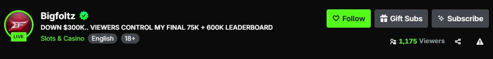
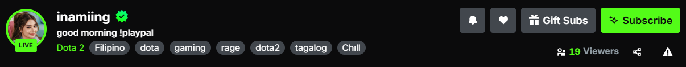
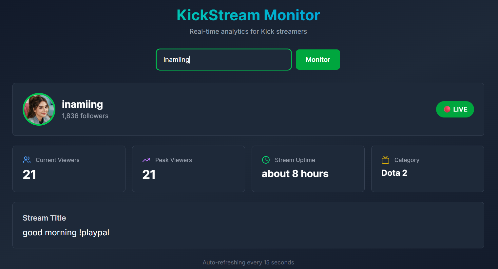
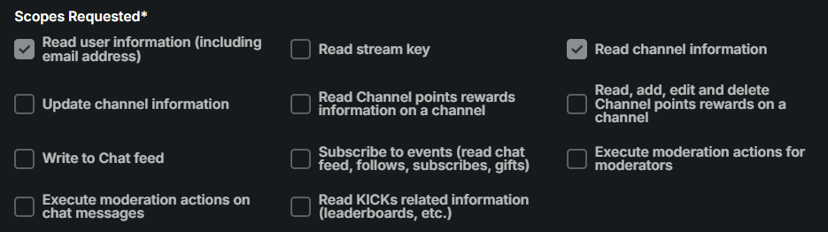

<p align="center">
  
</p>

# KickStream Monitor 🎮

A real-time analytics dashboard for Kick streamers. Monitor viewer counts, stream uptime, and channel statistics with automatic 15-second refresh intervals.

## ✨ Features

- 🔴 **Live Status** - Real-time online/offline detection
- 👥 **Viewer Count** - Current viewer metrics
- 📊 **Peak Viewers** - Session high tracking
- ⏱️ **Stream Uptime** - Live session duration
- 🎯 **Category Tracking** - Current game/category
- 📝 **Stream Title** - Live title display
- ♻️ **Auto-refresh** - Updates every 15 seconds
- 📱 **Responsive Design** - Works on all devices








## 🚀 Quick Start

### Prerequisites

- Node.js 18+ installed
- A Kick.com account (for API credentials)

### Installation

1. **Clone the repository**
```bash
git clone <your-repo-url>
cd kickstream-monitor
```

2. **Install dependencies**
```bash
npm install
```

3. **Set up environment variables**

Create a `.env.local` file in the root directory:

```env
KICK_CLIENT_ID=your_client_id_here
KICK_CLIENT_SECRET=your_client_secret_here
```

4. **Run the development server**
```bash
npm run dev
```

5. **Open your browser**

Navigate to [http://localhost:3000](http://localhost:3000)

## 🔑 Getting Kick API Credentials

1. Go to [Kick.com](https://kick.com)
2. Navigate to **Settings** → **Developer**
3. Click **Create New Application**
4. Select scopes:
   - ✅ Read user information (including email address)
   - ✅ Read channel information



5. Copy your **Client ID** and **Client Secret**
6. Add them to your `.env.local` file

For more details, visit [Kick Developer Documentation](https://github.com/KickEngineering/KickDevDocs)

## 📦 Tech Stack

| Layer | Technology |
|-------|-----------|
| **Framework** | Next.js 14 (App Router) |
| **Language** | TypeScript |
| **Styling** | Tailwind CSS |
| **UI Components** | Lucide React Icons |
| **Date Handling** | date-fns |
| **Deployment** | Vercel |

## 🌐 Deploy to Vercel

### Option 1: Deploy via Vercel Dashboard

1. Push your code to GitHub
2. Go to [vercel.com](https://vercel.com)
3. Click **New Project**
4. Import your repository
5. Add environment variables:
   - `KICK_CLIENT_ID`
   - `KICK_CLIENT_SECRET`
6. Click **Deploy**

### Option 2: Deploy via CLI

```bash
# Install Vercel CLI
npm i -g vercel

# Login
vercel login

# Deploy
vercel --prod
```

### Environment Variables on Vercel

In your Vercel project dashboard:

1. Go to **Settings** → **Environment Variables**
2. Add:
   - `KICK_CLIENT_ID` = `your_client_id`
   - `KICK_CLIENT_SECRET` = `your_client_secret`
3. Click **Save**
4. Redeploy your project

## 📁 Project Structure

```
kickstream-monitor/
├── app/
│   ├── api/
│   │   ├── proxy-image/
│   │   │   └── route.ts          # Image proxy endpoint
│   │   └── streamer/
│   │       └── [username]/
│   │           └── route.ts      # Streamer data API
│   ├── components/
│   │   └── StreamerDashboard.tsx # Main dashboard component
│   ├── layout.tsx                # Root layout
│   └── page.tsx                  # Home page
├── .env.local                    # Environment variables
├── next.config.js                # Next.js configuration
├── package.json                  # Dependencies
├── tailwind.config.ts            # Tailwind configuration
└── tsconfig.json                 # TypeScript configuration
```

## 🎯 Usage

1. Enter a Kick streamer username (e.g., `amateurgamer`, `nicklee`, `bakedalaska`)
2. Click **Monitor**
3. View real-time analytics:
   - Live/Offline status
   - Current viewer count
   - Peak viewers for the session
   - Stream uptime
   - Category/Game
   - Stream title

The dashboard auto-refreshes every 15 seconds to keep data current.

## 🛠️ Development

### Available Scripts

```bash
# Start development server
npm run dev

# Build for production
npm run build

# Start production server
npm start

# Run linter
npm run lint
```

### API Endpoints

#### Get Streamer Data
```
GET /api/streamer/[username]
```

**Response:**
```json
{
  "username": "xqc",
  "profilePic": "https://...",
  "isLive": true,
  "viewerCount": 45000,
  "title": "Gaming Stream",
  "category": "Just Chatting",
  "startTime": "2026-01-30T10:00:00Z",
  "followersCount": 2500000,
  "streamId": 123456
}
```

#### Proxy Image
```
GET /api/proxy-image?url=[encoded_image_url]
```

Returns the proxied image to bypass CORS restrictions.

### API Rate Limiting

The Kick API may rate limit requests. The app:
- Refreshes every 15 seconds (conservative)
- Uses proxy services to avoid direct blocking
- Implements error handling for failed requests

## 📝 Notes

- **API Coverage**: Kick's API is limited and may not expose all data
- **Viewer Count**: May lag slightly behind actual live counts
- **Rate Limits**: Be mindful of API rate limits with frequent requests
- **Unofficial API**: This uses Kick's public API which may change

## 📄 License

This project is licensed under the MIT License - see the [LICENSE](LICENSE) file for details.

## ⚠️ Disclaimer

This project is **not affiliated with or endorsed by Kick.com**. Use responsibly and in accordance with [Kick.com's Terms of Service](https://kick.com/terms-of-service).

**Built with ❤️ for the Kick streaming community**